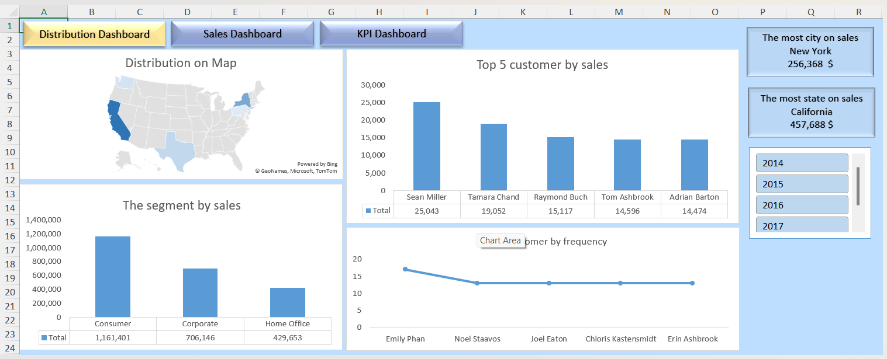
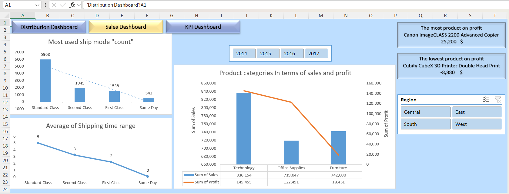
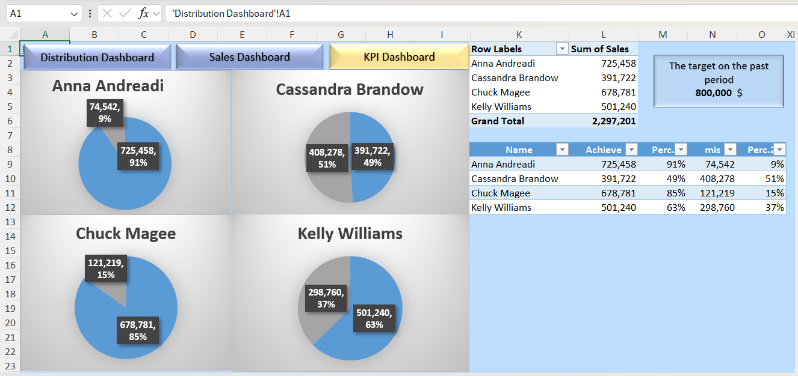

# Excel Data Analysis Project 📊

This project showcases an end-to-end data analysis using Microsoft Excel. It includes:

- Power Query for data cleaning & transformation
- Pivot Tables & Pivot Charts for insights
- KPI tracking
- Dashboards with slicers
- Business questions & decision-making support

---

## 📂 Folder Structure

- `data/`: Contains the Excel workbook
- `report/`: Contains the full PDF/Word report
- `screenshots/`: Preview of the dashboard

---

## 📈 Key Insights

- Top-performing categories by profit
- Most used shipping mode
- Customer loyalty indicators
- Sales by region & year

---

## 🧠 Tools Used

- Microsoft Excel
- Power Query
- Pivot Tables
- KPI cards
- Slicers & Dashboards

---

## 📸 Preview

---

## 📄 Report

 [View Full Business Report](Report)

